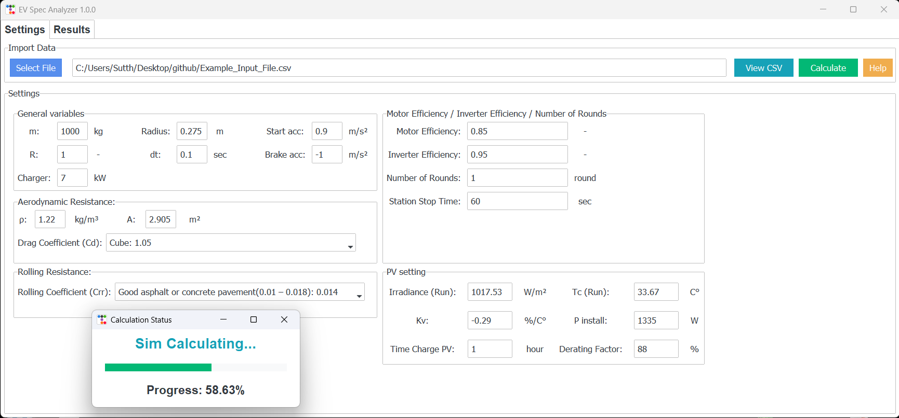
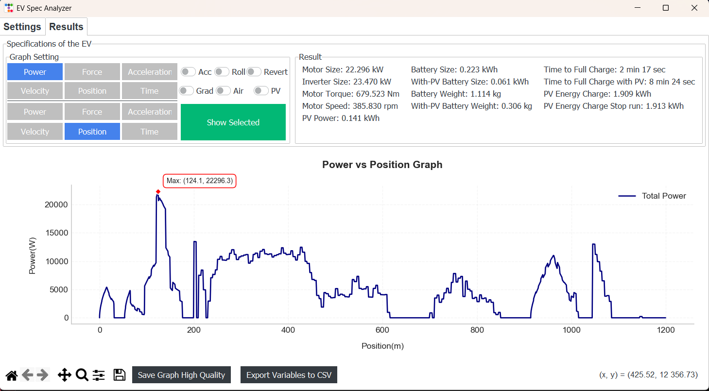

# EV-Spec-Analyzer

EV-Spec-Analyzer is a simulation program designed for analyzing and designing the specifications of electric vehicles (EV) using input route data in CSV file format along with various parameters to calculate motor size, battery capacity, and solar panel (PV) power if the vehicle is equipped.

### This program is part of an undergraduate study in Electrical and Automation Engineering in Thailand.

---

## Main Features

**Import CSV File** containing information about:

- Route distance
- Road slope
- Desired speed (the vehicle will try to maintain the desired speed)
- Solar radiation incident on the PV (if the vehicle is equipped with PV)
- Ambient temperature (affects PV efficiency)

**Simulation & Analysis**

- Calculate energy consumption for each section of the route
- Analyze suitable motor size
- Calculate necessary battery capacity
- Consider the impact of PV power

**Output Results**

- Export a CSV file with the motor and battery specifications
- Display graphs of energy consumption and related parameters

---

## Installation

1. Install Python or https://github.com/Sutthiphong-Nanan/EV-Spec-Analyzer/releases/tag/v1.0.0

```bash
winget install --id Python.Python.3.13 --accept-package-agreements --accept-source-agreements
```
or  Run Installer/install_Python.bat

2. Install the required libraries

```bash
pip install pandas numpy matplotlib ttkbootstrap PyMuPDF Pillow
```
or  Run Installer/install_library_EV-Spec-Analyzer.bat

3. Run the program in the "EV-Spec-Analyzer-Source-Code" folder

```bash
python EV-Spec-Analyzer-Source-Code/EV-Spec-Analyzer.py
```

---

## How to Use the Program

1. **Select the CSV file** containing the route information.
2. **Set the parameters** as needed.
3. **Start the simulation** and view the results.

---

## Configurable Parameters

### Vehicle Parameters

| Parameter     | Unit | Description               |
| ------------- | ---- | ------------------------- |
| `m`           | kg   | Total mass of the EV       |
| `radius`      | m    | Wheel radius of the vehicle|
| `R`           | -    | Gear ratio                |
| `start_acc`   | m/s² | Maximum acceleration rate |
| `brake_acc`   | m/s² | Maximum braking rate      |
| `dt`          | sec  | Time interval for each frame |
| `run_turn`    | round | Number of laps to run     |

### Route and Road Condition Parameters

| Parameter    | Unit   | Description              |
| ------------ | ------ | ----------------------- |
| `distance`   | m      | Route distance          |
| `angle`      | degree | Road slope              |
| `set_speed`  | km/h   | Desired speed           |
| `Crr`        | -      | Rolling Resistance      |
| `Cd`         | -      | Drag Coefficient        |
| `A`          | m²     | Vehicle frontal area    |
| `Ro`         | kg/m³  | Air density             |

### Electric Drive System Parameters

| Parameter            | Unit | Description                  |
| -------------------- | ----- | ---------------------------- |
| `eff_motor`          | %     | Motor efficiency             |
| `eff_inverter`       | %     | Inverter efficiency          |
| `station_stoptime`   | sec   | Stop time at station         |

### Solar Panel Parameters (If the vehicle is equipped with PV)

| Parameter           | Unit  | Description                    |
| ------------------- | ----- | ----------------------------- |
| `irradian_pv`       | W/m²  | Solar radiation intensity      |
| `temp_pv`           | °C    | Ambient temperature            |
| `P_install_PV`      | W     | Maximum PV power               |
| `K_v_PV`            | %/°C  | PV efficiency temperature coefficient |
| `G_pv`              | W/m²  | Reference solar radiation intensity |
| `T_c_PV`            | °C    | Actual operating temperature of PV |
| `f_pv`              | %     | Efficiency degradation factor  |
| `time_charge_pv`    | hr    | Charging time from PV          |

---

## Summary

EV-Spec-Analyzer calculates the energy consumption of an EV based on the specified route:

- Calculates the motor specifications required
- Analyzes the effect of PV on reducing battery size
- Calculates the charging time required for the battery

---

## Sample Screenshots

### 1. Parameter Setup


### 2. Calculation Results


---
