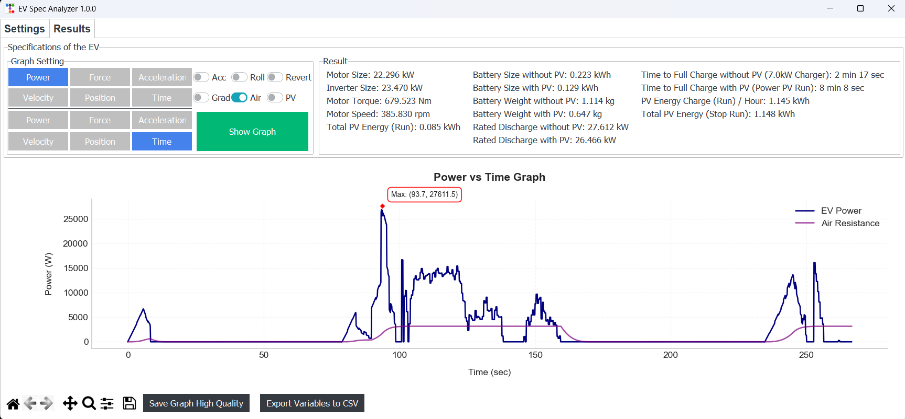

# EV-Spec-Analyzer

EV-Spec-Analyzer is a simulation program designed for analyzing and designing the specifications of electric vehicles (EV) using input route data in CSV file format along with various parameters to calculate motor size, battery capacity, and solar panel (PV) power if the vehicle is equipped.

### This program is part of an undergraduate study in Electrical and Automation Engineering in Thailand.

---

## Main Features

**Import CSV File** containing information about:

- Route distance
- Road slope
- Desired speed (the vehicle will try to maintain the desired speed)
- Solar radiation incident on the PV (if the vehicle is equipped with PV)
- Ambient temperature (affects PV efficiency)

**Simulation & Analysis**

- Calculate energy consumption for each section of the route
- Analyze suitable motor size
- Calculate necessary battery capacity
- Consider the impact of PV power

**Output Results**

- Export a CSV file with the motor and battery specifications
- Display graphs of energy consumption and related parameters

---

## Installation

1. Install Python

```bash
winget install --id Python.Python.3.13 --accept-package-agreements --accept-source-agreements
```
or  Run Installer/install_Python.bat

2. Install the required libraries

```bash
pip install pandas numpy matplotlib ttkbootstrap PyMuPDF Pillow
```
or  Run Installer/install_library_EV-Spec-Analyzer.bat

3. Run the program in the "EV-Spec-Analyzer-Source-Code" folder

```bash
python EV-Spec-Analyzer-Source-Code/EV-Spec-Analyzer.py
```

---

## How to Use the Program

1. **Select the CSV file** containing the route information.
2. **Set the parameters** as needed.
3. **Start the simulation** and view the results.

---

## Configurable Parameters

### Vehicle Parameters

| Parameter     | Unit | Description               |
| ------------- | ---- | ------------------------- |
| `m`           | kg   | Total mass of the EV       |
| `radius`      | m    | Wheel radius of the vehicle|
| `R`           | -    | Gear ratio                |
| `start_acc`   | m/s² | Maximum acceleration rate |
| `brake_acc`   | m/s² | Maximum braking rate      |
| `dt`          | sec  | Time interval for each frame |
| `run_turn`    | round | Number of laps to run     |

### Route and Road Condition Parameters

| Parameter    | Unit   | Description              |
| ------------ | ------ | ----------------------- |
| `distance`   | m      | Route distance          |
| `angle`      | degree | Road slope              |
| `set_speed`  | km/h   | Desired speed           |
| `Crr`        | -      | Rolling Resistance      |
| `Cd`         | -      | Drag Coefficient        |
| `A`          | m²     | Vehicle frontal area    |
| `Ro`         | kg/m³  | Air density             |

### Electric Drive System Parameters

| Parameter            | Unit | Description                  |
| -------------------- | ----- | ---------------------------- |
| `eff_motor`          | %     | Motor efficiency             |
| `eff_inverter`       | %     | Inverter efficiency          |
| `station_stoptime`   | sec   | Stop time at station         |

### Solar Panel Parameters (If the vehicle is equipped with PV)

| Parameter           | Unit  | Description                    |
| ------------------- | ----- | ----------------------------- |
| `irradian_pv`       | W/m²  | Solar radiation intensity      |
| `temp_pv`           | °C    | Ambient temperature            |
| `P_install_PV`      | W     | Maximum PV power               |
| `K_v_PV`            | %/°C  | PV efficiency temperature coefficient |
| `G_pv`              | W/m²  | Reference solar radiation intensity |
| `T_c_PV`            | °C    | Actual operating temperature of PV |
| `f_pv`              | %     | Efficiency degradation factor  |
| `time_charge_pv`    | hr    | Charging time from PV          |

---

## Summary

EV-Spec-Analyzer calculates the energy consumption of an EV based on the specified route:

- Calculates the motor specifications required
- Analyzes the effect of PV on reducing battery size
- Calculates the charging time required for the battery

---

## Sample Screenshots

### 1. Parameter Setup


### 2. Calculation Results


---

# EV-Spec-Analyzer

EV-Spec-Analyzer เป็นโปรแกรมจำลองสำหรับวิเคราะห์และออกแบบสเปคของยานยนต์ไฟฟ้า (EV) โดยใช้ข้อมูลเส้นทางที่ป้อนเข้าไปในรูปแบบไฟล์ CSV และพารามิเตอร์ต่างๆ เพื่อคำนวณขนาดมอเตอร์ ขนาดแบตเตอรี่ และพลังงานจากแผงโซลาร์เซลล์ (PV) หากรถมีการติดตั้ง

### โปรแกรมนี้เป็นส่วนหนึ่งของการศึกษาระดับปริญญาตรีในสาขาวิศวกรรมไฟฟ้าและอัตโนมัติ

---

## คุณสมบัติหลัก

**นำเข้าไฟล์ CSV** ที่มีข้อมูลเกี่ยวกับ:

- ระยะทางของเส้นทาง
- ความชันของถนน
- ความเร็วที่ต้องการ (รถจะพยายามรักษาความเร็วตามที่กำหนด)
- ค่าการแผ่รังสีของดวงอาทิตย์ที่กระทบ PV (ถ้ารถมีการติดตั้ง PV)
- อุณหภูมิอากาศ (ส่งผลต่อประสิทธิภาพของ PV)

**Simulation & Analysis**

- คำนวณพลังงานที่ต้องใช้ในแต่ละช่วงของเส้นทาง
- วิเคราะห์ขนาดมอเตอร์ที่เหมาะสม
- คำนวณความจุแบตเตอรี่ที่จำเป็น
- พิจารณาผลกระทบของพลังงานจาก PV

**แสดงผลลัพธ์**

- ส่งออกไฟล์ CSV ที่มีข้อมูลสเปคของมอเตอร์และแบตเตอรี่ที่จำเป็น
- ดูกราฟการใช้พลังงานและพารามิเตอร์ที่เกี่ยวข้อง

---

## การติดตั้ง

1. ติดตั้ง Python

```bash
winget install --id Python.Python.3.13 --accept-package-agreements --accept-source-agreements
```
หรือ  Run Installer/install_Python.bat

2. ติดตั้งไลบรารีที่จำเป็น

```bash
pip install pandas numpy matplotlib ttkbootstrap PyMuPDF Pillow
```
หรือ  Run Installer/install_library_EV-Spec-Analyzer.bat

3. รันโปรแกรมในโฟลเดอร์ " EV-Spec-Analyzer-Source-Code "

```bash
python EV-Spec-Analyzer-Source-Code/EV-Spec-Analyzer.py
```

---

## วิธีใช้งานโปรแกรม

1. **เลือกไฟล์ CSV** ที่มีข้อมูลเส้นทาง
2. **กำหนดพารามิเตอร์ต่างๆ** ตามต้องการ
3. **เริ่มการจำลอง** และดูผลลัพธ์ที่ได้

---

## พารามิเตอร์ที่กำหนดค่าได้

### พารามิเตอร์เกี่ยวกับยานยนต์

| พารามิเตอร์ | หน่วย | คำอธิบาย           |
| ----------- | ----- | ------------------ |
| `m`         | kg    | มวลรวมของรถ EV     |
| `radius`    | m     | รัศมีล้อของรถ      |
| `R`         | -     | อัตราทดเกียร์      |
| `start_acc` | m/s²  | อัตราเร่งสูงสุด    |
| `brake_acc` | m/s²  | อัตราการเบรกสูงสุด |
| `dt`        | sec   | ช่วงเวลาการคำนวณในแต่ละเฟรม   |
| `run_turn`  | round   | จำนวนรอบที่วิ่ง    |

### พารามิเตอร์เส้นทางและสภาพถนน

| พารามิเตอร์ | หน่วย  | คำอธิบาย            |
| ----------- | ------ | ------------------- |
| `distance`  | m      | ระยะทางของเส้นทาง   |
| `angle`     | degree | ความชันของถนน       |
| `set_speed` | km/h   | ความเร็วที่ต้องการ  |
| `Crr`       | -      | Rolling Resistance  |
| `Cd`        | -      | Drag Coefficient    |
| `A`         | m²     | พื้นที่หน้าตัดของรถ |
| `Ro`        | kg/m³  | ความหนาแน่นของอากาศ |

### พารามิเตอร์ระบบขับเคลื่อนไฟฟ้า

| พารามิเตอร์        | หน่วย | คำอธิบาย                    |
| ------------------ | ----- | --------------------------- |
| `eff_motor`        | %     | ประสิทธิภาพของมอเตอร์       |
| `eff_inverter`     | %     | ประสิทธิภาพของอินเวอร์เตอร์ |
| `station_stoptime` | sec   | เวลาหยุดจอด                 |

### พารามิเตอร์ของแผงโซลาร์เซลล์ (ถ้ารถติดตั้ง PV)

| พารามิเตอร์      | หน่วย | คำอธิบาย                  |
| ---------------- | ----- | ------------------------- |
| `irradian_pv`    | W/m²  | ค่าการแผ่รังสีของแสง      |
| `temp_pv`        | °C    | อุณหภูมิอากาศ             |
| `P_install_PV`   | W     | กำลังไฟฟ้าสูงสุดของ PV    |
| `K_v_PV`         | %/°C  | ค่าลดประสิทธิภาพ PV       |
| `G_pv`           | W/m²  | ค่าการแผ่รังสีอ้างอิง     |
| `T_c_PV`         | °C    | อุณหภูมิที่ PV ใช้งานจริง |
| `f_pv`           | %     | ค่าการลดประสิทธิภาพ       |
| `time_charge_pv` | hr    | เวลาชาร์จจาก PV           |

---

## สรุป

EV-Spec-Analyzer สามารถคำนวณการใช้พลังงานของ EV ตามเส้นทางที่กำหนด
- คำนวณสเปคของมอเตอร์ที่ต้องใช้
- วิเคราะห์ผลกระทบของ PV ต่อการลดขนาดแบตเตอรี่
- คำนวณระยะเวลาที่ต้องใช้ในการชาร์จแบตเตอรี่

---

